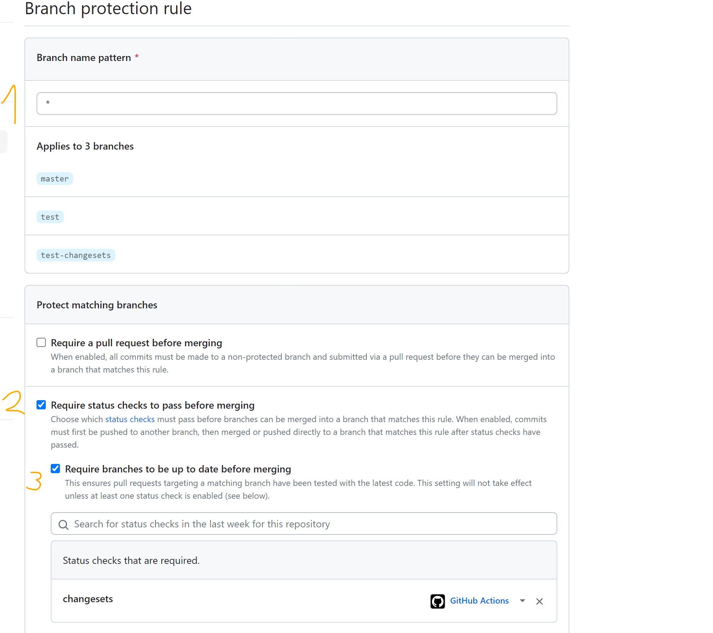

# Changelog and versioning

## Setup

We need first to setup the changeset tool. To do that we can use the `npm install @changesets/cli && npx changeset init` command. This will generate a `.changeset` folder that includes the configuration of the tool and instructions how to use it.

Before we continue it is **required** to add the following to the package.json in the repo root:

```diff
  "name": "gameuicomponents",
  "version": "1.0.0",
  "description": "",
  "main": "webpack.config.js",
+ "workspaces": [
+   "lib",
+   "interaction-manager",
+   "components/*"
+ ],
  "directories": {
    "example": "examples",
    "lib": "lib"
  },
```

We need this otherise the tool is not going to detect the component packages and you will not be able to bump their versions and generate changelog.

After that we need to change a bit the `config.json` that is generated from changeset tool when initialized.

```diff
{
  "$schema": "https://unpkg.com/@changesets/config@2.3.1/schema.json",
  "changelog": "@changesets/cli/changelog",
  "commit": false,
  "fixed": [],
  "linked": [],
- "access": "private",
+ "access": "public",
- "baseBranch": "main",
+ "baseBranch": "master",
  "updateInternalDependencies": "patch",
  "ignore": []
}
```

These changes are required so the tool compare the changes of some branch with master.

## How to bump version - [`npx changeset`](https://github.com/changesets/changesets/blob/main/docs/command-line-options.md#add)

To bump packages versions we can use the `npx changeset` command. Running it will promp you couple of things.

1. Choose the packages you want to bump.
2. Choose which packages are having major, minor and patch update.
3. Type the changelog. **Note that the message you type in this step will be applied the same for the changelog of each package you are updating.** Because of that make sure you review the generated .md files before continue with the other steps.

The command will generate randomly named .md files for each package that you selected with the message you typed.

In the language of the changeset too it will generate `changeset` which is the randomly generated .md file.

**Note if we add [required step](#prs-integration) in the PRs to have changelog and if we don't want our change to have changelog (for example we fixed some test or reworded documentation) then we can add an empty changeset with the `npx changeset --empty` to skip force skip the check.**

## How to generate the changelog of the updated packages - [`npx changeset version`](https://github.com/changesets/changesets/blob/main/docs/command-line-options.md#version)

To generate the changelog of the updated packages from the previous step use the `npx changeset version` command. It will take all the randomly generated .md files and create a CHANGELOG.md file for each package with content of those files.

Also it will automatically bump the package.json of each package.

When the command finishes you will have changes to the CHANGELOG.md and package.json of each package.

In the language of the changeset too it will get all the `changesets` generated so far with the `npx changeset` command and generate changelog based on them and bump the package.json version of the packages. If there are no changesets it will not do anything.

## How to check if there are changesets - [`npx changeset status`](https://github.com/changesets/changesets/blob/main/docs/command-line-options.md#status)

The following command `npx changeset status` will check if there are changesets generated. This command is usefull if we add restrictions to the PRs about version bump and changelog to be required.

### PRs integration

We can integrate this command in the Run tests action for example adding the following to the node.js.yml:

```yml
  changesets:
    runs-on: windows-latest
    steps:
     - uses: actions/checkout@v2
       with:
        fetch-depth: 0
     - name: Use Node.js ${{ matrix.node-version }}
       uses: actions/setup-node@v2
       with:
        node-version: ${{ matrix.node-version }}
     - name: Install modules
       run: npm i
     - name: Check for changesets
       run: npx changeset status
```

Also if we want to block the PRs for being merged to master we need to enable some settings in the repo.



1. Here we need to add a branch pattern that will be applied just to PRs but I did not find how to exactly do it so I added the `*` just for the test.
2. We need to enable the status check.
3. Select the check that is required - in our case it is named `changesets`

## How to publish version to npm and create a release - [`npx changeset publish`](https://github.com/changesets/changesets/blob/main/docs/command-line-options.md#publish)

Running the `npx changeset publish` will publish all the new package versions to npm and will create a tag with the packages versions on the latest commit in master.

Also it is recommended to do `git push --follow-tags` after the publish finishes so the tags are pushed in the repo.

### Some problems occurred when testing this feature

* I was unable to authenticate to npm when executing the command from and action.
* I needed to login to npm via my terminal so the command is successfull when ran locally.

### Limitations

This command does not release a new version to git with the published and tagged packages. We need additional script that does this step.

This command can't just tag without publishing the packages. This limitates us because we already have script that publishes the packages and we can use it instead this command. However there is another command that does this tagging.

## Tag package versions - [`npx changeset tag`](https://github.com/changesets/changesets/blob/main/docs/command-line-options.md#tag)

This command will tag all the new releases of the packages in the repo. We can use this command if we don't want to use `npx changeset publish` and use our publish script instead and after it finishes run the `npx changeset tag` to tag the releases and then push the tags in the repo - `git push --follow-tags`.

## Manual workflow of updating component version and writing changelog (proposal)

When you change a component and you are on the step of updating its version and writing a changelog you need to do this with the help of the changeset tool.

### Prepare package for update

1. Run `npx changeset` and
   1. Choose the package you want to update
   2. Select which version you want to bump -> major, minor or patch
   3. Type the message that will be used as a changelog. Review the text and commit the changes.

After the command passes the version in the package json won't be changed and the changelog.md won't be generated. For this to happen we need to run the `npx version` command that will do it automatically for us. For that reason we have two options.

### Manually update the version

1. Run `npx version` and review the changes in the CHANGELOG.md file
2. Commit the update.

Pros:

* You can review the final changelog and make changes before merging the PR.
* You can review the version bump in the package.json of the component.

Cons:

* Not automatic
* This step could be easily skipped and forgotten.

## Automatic workflow of updating component version and writing changelog (proposal)

### Changeset bot

We can add the changeset bot to the PRs that will notify you about the changeset status and reminds you to add a changeset if there is none added to the PR.

However, this bot requires some permissions to the repo so I am no sure we want it.

### Auto update version

We can add an action that will run the `npx version` command directly right before merge. In order this to work when the command finishes additional commit will be added to the PR before merge with the generated changelog and bumped version in the package.json.

To do that we need to add another action to our repo worflows. In the [changeset documentation](https://github.com/changesets/changesets/blob/main/docs/automating-changesets.md#automating-changesets) is explaned a way how to automatize the process.

IMO we need to do the [required check](#prs-integration) here for the PRs to prevent running the action if there are no changesets added. That will force everyone of us to add changeset to the PR.

So the action that will update the versions is the following (I tested with it in the fork repo):

```yml
name: Release

on:
  push:
    branches:
      - master

jobs:
  release:
    name: Release
    runs-on: ubuntu-latest
    strategy:
      matrix:
        node-version: [16.10.0]
    steps:
      - name: Checkout Repo
        uses: actions/checkout@v3

      - name: Use Node.js ${{ matrix.node-version }}
        uses: actions/setup-node@v2
        with:
          node-version: ${{ matrix.node-version }}

      - name: Install Dependencies
        run: npm i

      - name: Create Release Pull Request or Publish to npm
        id: changesets
        uses: changesets/action@v1
        env:
          GITHUB_TOKEN: ${{ secrets.GITHUB_TOKEN }}

      - name: Publish
        if: steps.changesets.outputs.hasChangesets == 'false'
        # You can do something when a publish should happen.
        run: npm config set '//registry.npmjs.org/:_authToken' "${{ secrets.NPM_TOKEN }}" && npx changeset publish
        env:
          GITHUB_TOKEN: ${{ secrets.GITHUB_TOKEN }}
          NPM_TOKEN: ${{ secrets.NPM_TOKEN }}
```

This action will work in the following way. If we merge an approved PR with changesets added to master then the action will create a new PR to the repo with `Version packages` title that includes all the changelog and version bump of the packages from the merged PR.

When this new PR is merged to master the action will be triggered again and will recognize that there are no new changesets and will continue with publishing the packages to npm.

If we merge another PR before the `Version packages` PR is merged it will be updated if there are new changesets automatically.

Pros:

* The process is automated
* We can add restrictions to the PRs so they can't be merged if you didn't create a changeset via `npx changeset` command.
* The step can't be skipped and is required!

Cons:

* A new PR - `Version packages` is created with the release changelog
* We need to review the new changelog before merging this `Version packages` PR
* We need to add permissions to github bot to read, write, create and approve PRs. Otherwise the `Version packages` PR could not be created/updated automatically.
* Or we need to install the changeset bot to do that for us but additional permissions should be allowed to it.

### Skip the `Version packages` PR

We can skip the creation of such PR and directly generate the changelog via `npx changeset version` when PR is merged to master. However this will be accompanied with additonal commit that we need automatically to do.

We can do that by enhancing the publish.yml file with running `npx changeset version` command before publish.

The problem with that is we are not able to review the generated changelog from the command and we need to make sure everything is good with the content when we use the `npx changeset` for creating a changesets before merging our PRs.

## Changelog pattern could not be changed easily so far with this tool

This tool is nice but currently there is a no trivial way to change the changelog content. They have provided a page where it is described how to do that but this feature is still in [progress](https://github.com/changesets/changesets/blob/main/docs/modifying-changelog-format.md) (To do).

So we need to change the changelog manually each time it is generated by this tool.

## Update the changelog in the documentation

The tool creates a CHANGELOG.md file for each package. That means we can easily rework the transfer docs script to transfer the changelog as well. Here we need to discuss where exactly this .md file should be transferred.

## Create a release for the new versions in the repo

If we want to do this we need to write our own script that releases the generated tags from changeset with the changelog generated for each package.

The changeset tool does not provide such an option so far.

## Linked packages

This tool has feature that we can [link](https://github.com/changesets/changesets/blob/main/docs/linked-packages.md) some packages. This will allow us to group packages that should be versioned toggether.

This could be useful and we can deprecate our script that when `coherent-gameface-components` package has major version update to update every component with the new library version.
