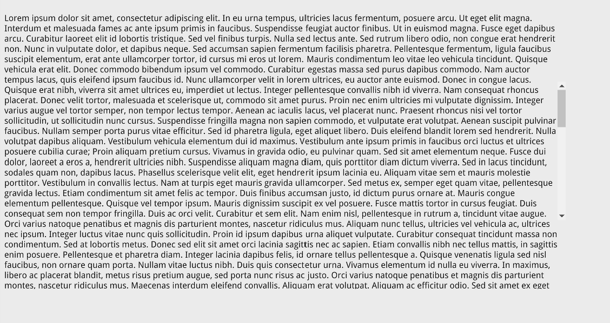

<!--Copyright (c) Coherent Labs AD. All rights reserved. Licensed under the MIT License. See License.txt in the project root for license information. -->

<a href="https://www.npmjs.com/package/coherent-gameface-scrollable-container"></a>

The gameface-scrollable-container is part of the Gameface custom components suite. As most of the components in this suite it uses slots to allow dynamic content.

Installation
===================

```
npm i coherent-gameface-scrollable-container
```

## Usage with UMD:

~~~~{.html}
<script src="./node_modules/coherent-gameface-scrollable-container/dist/scrollable-container.production.min.js"></script>
~~~~

* add the gameface-scrollable-container component to your html:

~~~~{.html}
<gameface-scrollable-container class="scrollable-container-component"></gameface-scrollable-container>
~~~~

This is all! Load the file in Gameface to see the gameface-scrollable-container.

## Usage with JavaScript:

If you wish to import the ScrollableContainer using JavaScript you can remove the script tag and import it like this:

~~~~{.js}
import { ScrollableContainer } from 'coherent-gameface-scrollable-container';
~~~~

or simply

~~~~{.js}
import 'coherent-gameface-scrollable-container';
~~~~

Note that this approach requires a module bundler like [Webpack](https://webpack.js.org/) or [Rollup](https://rollupjs.org/guide/en/) to resolve the
modules from the node_modules folder.

## Add the Styles

~~~~{.css}
<link rel="stylesheet" href="coherent-gameface-components-theme.css">
<link rel="stylesheet" href="style.css">
<link rel="stylesheet" href="node_modules/coherent-gameface-slider/styles/horizontal.css">
<link rel="stylesheet" href="node_modules/coherent-gameface-slider/styles/vertical.css">
~~~~

To overwrite the default styles, simply create new rules for the class names that
you wish to change and include them after the default styles.

## Manually showing and resizing the scrollbar

If the scrollable container is hidden, you'll need to manually re-initialize the scrollbar once you show the scrollable container.
The scrollable container has a method called **showScrollBar**. It accepts the scrollbar as an argument:

~~~~{.js}
const scrollableContainer = document.querySelector('.guic-scrollable-container');
scrollableContainer.showScrollBar(scrollableContainer.scrollbar);
~~~~

To resize the scrollbar call the **resize** function of the scrollbar and pass it the
scrollable container as an argument:

~~~~{.js}
const scrollableContent = scrollableContainer.querySelector('[name="scrollable-content"]');
const scrollableContainer = document.querySelector('.guic-scrollable-container');

scrollableContainer.scrollbar.resize(scrollableContent);
~~~~

The scrollableContainer has a method called **shouldShowScrollbar** which checks if the scrollable content is bigger than the scrollable container and if it is - it shows the scrollbar. Use this if you are not sure if you have to show the scrollbar:

~~~~{.js}
const scrollableContainer = document.querySelector('.guic-scrollable-container');
scrollableContainer.shouldShowScrollbar();
~~~~

**Note: If an element that holds a scrollable container is initially hidden you need to force check if the scrollable container should be shown via the `shouldShowScrollbar` method when the element becomes visible. Otherwise, the slider of the scrollable container might not be visible.**

If you need to hide the scrollbar - use the **hideScrollBar method** and pass it the scrollbar as an argument:

~~~~{.js}
const scrollableContainer = document.querySelector('.guic-scrollable-container');
scrollableContainer.hideScrollBar(scrollableContainer.scrollbar);
~~~~

## Automatically showing and resizing the scrollbar

To automatically show, hide and resize the scrollbar set the `automatic` attribute to the `<gameface-scrollable-container>` element. This will initiate an observer that will monitor the `scrollable-container` for changes so that it can automatically re-adjust itself if it has to. *Keep in mind that a [mutationObserver](https://developer.mozilla.org/en-US/docs/Web/API/MutationObserver) can affect the performance of your UI. Consider manually re-adjusting the scrollbar if its content will change multiple tiles in a frame.*

`<gameface-scrollable-container class="scrollable-container-component fixed-width" automatic>`

## Manually scrolling scrollbar to position

### Scroll to px

To scroll the scrollbar manually with JavaScript you can set the `scrollTop` of the scrollable container in `px` and then call the `onScroll` method of the scrollable container component.

```javascript
const scrollableContainerComponent = document.querySelector('gameface-scrollable-container');
const scrollableContainer = scrollableContainerComponent.querySelector('.guic-scrollable-container');
scrollableContainer.scrollTop = 100; // Will move the slider and content with 100px from the top.
scrollableContainerComponent.onScroll();
```

### Scroll to element

If you want to scroll to an element that is inside the scrollable container you can use the `scrollToElement` method. It accepts two arguments:

* **element (Required)** - The `HTMLElement` inside the `<component-slot data-name="scrollable-content">` element of the scrollable container.
* **alignment (Optional. Default = 'start')** - The alignment of the element into the visible area of the scrollable container when the container is scrolled to the element. Either:
  * **start** - Will align the element at the top of the container.
  * **center** - Will align the element at the center of the container.
  * **end** - Will align the element at the end of the container.

```javascript
const element = document.querySlector('.item') // This element should be inside the scrollable container's content added with the `<component-slot data-name="scrollable-content">`.
const scrollableContainerComponent = document.querySelector('gameface-scrollable-container');
scrollableContainerComponent.scrollToElement(element);
```

### Scroll to percents

If you want to scroll the scrollbar to some percent of the whole scrollable area you can use the `scrollToPercents` method of the scrollable container component:

```javascript
const scrollableContainerComponent = document.querySelector('gameface-scrollable-container');
scrollableContainerComponent.scrollToPercents(50); // Will scroll to the middle of the scrollable area which is 50%
```

## Events

Every time the scrollbar is scrolled it dispatches a custom event - `scroll`. You can listen for it if you need to react to the scrolling of the container just do:

```js
document.querySelector('gameface-scrollable-container').addEventListener('scroll', () => {
    console.log('The content was scrolled.');
});
```

## Specific Behavior

If you want to change the default height of the scrollable container you can do this by CSS:

```CSS
gameface-scrollable-container {
    height: 80%; /* 80% of the parent container's height */
}
```

Relative units are supported as well.

## Fixed slider height

The used `gameface-slider` component is always 100% of the size of the `gameface-scrollable-container`.

If you wish to customize the slider within the scrollable container to maintain a fixed height rather than dynamically adjusting to the container's height, you can apply the `fixed-slider-height` attribute to the `gameface-scrollable-container`:

`<gameface-scrollable-container fixed-slider-height></gameface-scrollable-container>`.

Subsequently, you can define the slider's height by overriding the `.guic-vertical-slider-wrapper` class.

For instance, in the demo of the scrollable container, a smaller slider height is set, and it is vertically centered along the Y axis using the following CSS:

```CSS
.guic-vertical-slider-wrapper {
    position: relative;
    top: 50%;
    transform: translateY(-50%);
    height: 50%;
}
```


