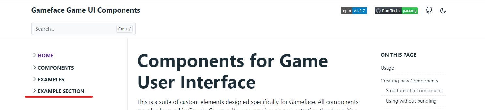
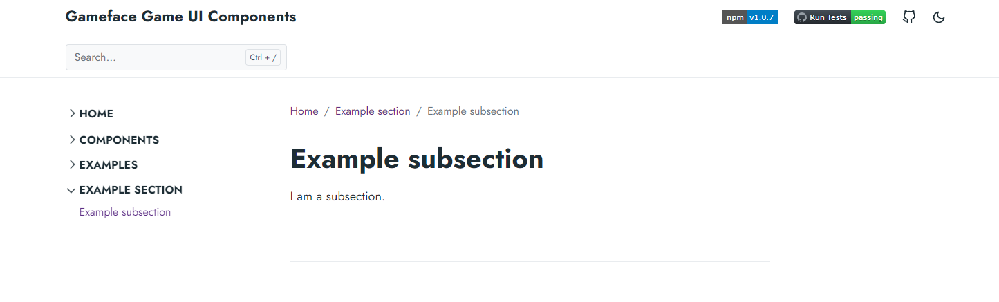
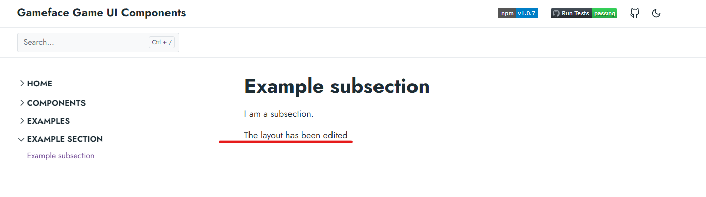
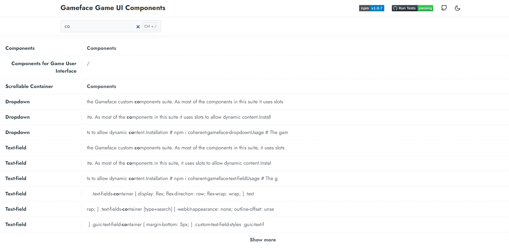

This is the documentation source of the GameUIComponents.

# Getting Started

The documentation is built using [Hugo - a framework for building websites](https://gohugo.io/). You need to install it globally in order to be able to use it. The installation steps vary depending on the operating system on which it will be used. For Windows you can [download](https://github.com/gohugoio/hugo/releases) the non-extended version. Extract the files and add the containing folder to the user PATH variable. Refer to the [documentation](https://gohugo.io/getting-started/installing/) for more information.

You need to install hugo with a version higher than 0.80. The documentation is tested with version 0.92.

Before you start the hugo server you need to fetch the theme. Run:

```
git submodule update --init
```

After hugo is installed navigate to the /docs folder.

Perform an `npm install` to install the npm modules.

Now run:

```
hugo server --bind=0.0.0.0 --disableFastRender
```

or

```
hugo server -D -F
```

 -F or --buildFuture is to configure Hugo to include content with publishdate in the future. The publish date that we use is the current local date. but Hugo uses some other time zone for reference, so the current local date seems in the future.

to start a development server.

Open `localhost:1313/GameUIComponents/` to see the documentation.

# Adding a page

All components must have an info page that explains what the component is and how to use it and an interactive demo page that shows how the component looks and how it works. Most of the documentation files are automatically copied from the source. Run `node scripts/transfer-doc-files.js` in the root of the repo to copy all documentation files[^1] or `npm run build:documentation` to build the components and copy the documentation files.

1. The documentation pages are located in content/components. These are the markdown files that describe the components. They are automatically copied from the source of the component.
2. The demo pages are located in content/examples/. All demo pages must have a [front matter](https://gohugo.io/content-management/front-matter/) and the copyright notice comment:

~~~~{.html}
---
title: "Component Name"
date: 2020-10-08T14:00:45Z
draft: false
---

<!--Copyright (c) Coherent Labs AD. All rights reserved. -->
~~~~

3. The static files used for the demos are located in static/components or in static/images.
The static/components/ folder contains the JavaScript source of the component as well as its styles.
The static/images/ folder contains any images used in the demos.

Make sure all required files are present, run `hugo` or `hugo server` to test your changes in a
static build and a development server respectively.


[^1]: The example `.html` page is not automatically copied as most of the times
it has to be different than the demo in the source - usually simpler or with different styles that better fit
the documentation site. The images are not copied for the same reason.

# Editing the theme

## Adding a new section in the documentation

* Add a new directory inside the `content`. For example `content/exampleSection`.
* Add an `_index.md` file in this directory with the following content.
```
---
title: "Example section"
date: 2022-02-02T14:00:45Z
draft: false
---
```

* Add a subsection by making another `.md` file inside the `content/exampleSection` with the name `exampleSubsection.md` with the following content.
```
---
title: "Example subsection"
date: 2022-02-02T14:00:45Z
draft: false
---

I am a subsection.
```


## Predefine the default section layout

If you want to predefine the default section layout you need to:

* Create a new folder inside the `layouts` folder with the name of the section. For example `layouts/exampleSection`.
* Add new file with the name `single.html` inside `layouts/exampleSection`.
* Define the html code inside the `single.html`. For template you can use the code that is inside `layouts/_default/single.html`. This is an example code that is same as `layouts/_default/single.html` but with some modifications.
```html
{{ define "main" }}
    <div class="row flex-xl-nowrap">
        <div class="col-lg-5 col-xl-4 docs-sidebar d-none d-lg-block">
            <nav class="docs-links" aria-label="Main navigation">
                {{ partial "sidebar/docs-menu.html" . }}
            </nav>
        </div>
        <main class="docs-content col-lg-11 col-xl-9 mx-xl-auto">
            <h1>{{ .Title }}</h1>
            <p class="lead">{{ .Params.lead | safeHTML }}</p>
            {{ .Content }}
            The layout has been edited
        </main>
    </div>
{{ end }}
```


## Edit the search engine

The search of the documentation is split into two search bars: 
* One that shows a few results and it is visible on each page. If you want to open the full search page you can press `Enter` or click on the `Show more` button.

* Full search that is a separate page in the documentation and shows all the results. Also, it shows pagination if the results are more than 20.


To edit the functionality of the minimal search you need to open the `assets/js/index.js`.

To edit the functionality of the full search you need to open the `assets/js/fullSearch.js`.

To edit the common functionality of both search bars you need to open `assets/js/search-utilities.js`.

To edit the full search layout page you need to navigate to `layouts/search/single.html`.

## Adding an additional JavaSript file

* Open `layouts/partials/footer/script-footer.html`.
* Add a new variable for the script file in the file on the top.
```html
{{ $newFileTemplate := resources.Get "js/newFile.js" -}}
{{ $newFile := $newFileTemplate | resources.ExecuteAsTemplate "newFile.js" . -}}
```
* Add a development build after the line `{{ if eq (hugo.Environment) "development" -}}`
```html
<script src="{{ $newFile.RelPermalink }}" defer></script>
```
* Add a production build after the else condition of the `{{ if eq (hugo.Environment) "development" -}}`
```html
{{ else -}}
  {{ $newFile := $newFile | minify | fingerprint "sha512" -}}
  <script src="{{ $newFile.RelPermalink }}" integrity="{{ $newFile.Data.Integrity }}" crossorigin="anonymous" defer></script>
```
